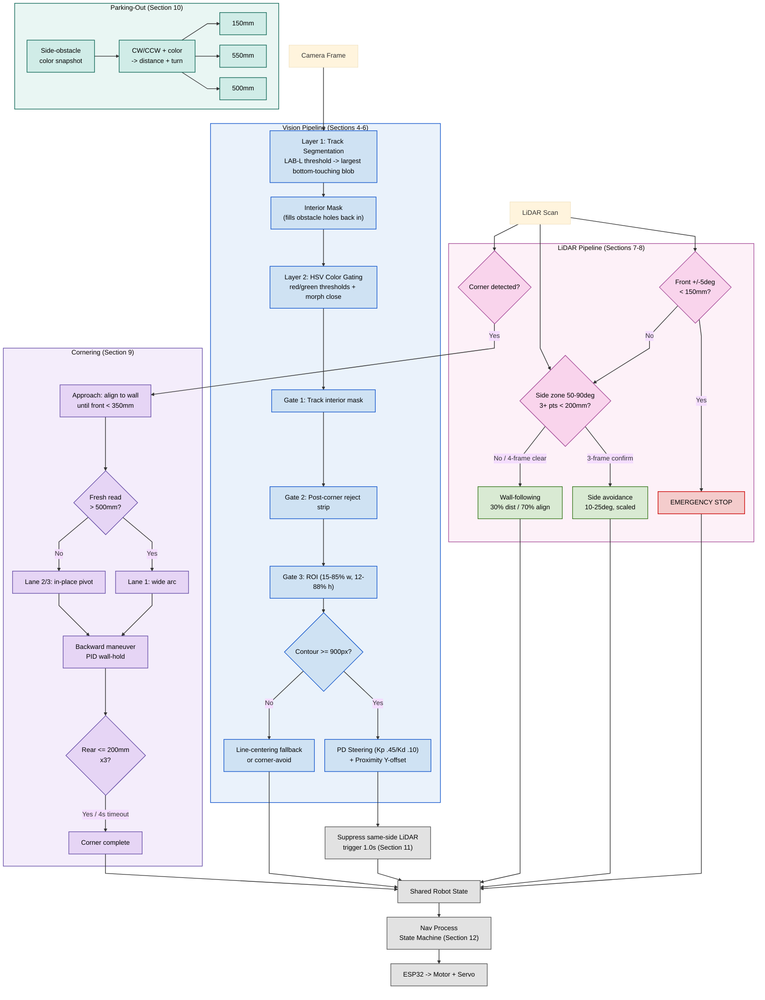

```mermaid
%%{init: {'theme': 'base', 'themeVariables': {'lineColor': '#333333'}, 'flowchart': {'nodeSpacing': 25, 'rankSpacing': 35, 'curve': 'linear'}}}%%
flowchart TD
    CAM[Camera Frame] --> L1
    LID[LiDAR Scan] --> LF
    LID --> LS
    LID --> LC

    subgraph VISION["Vision Pipeline (Sections 4-6)"]
        L1["Layer 1: Track Segmentation<br/>LAB-L threshold -> largest bottom-touching blob"]
        L1 --> IM["Interior Mask<br/>(fills obstacle holes back in)"]
        IM --> L2["Layer 2: HSV Color Gating<br/>red/green thresholds + morph close"]
        L2 --> G1["Gate 1: Track interior mask"]
        G1 --> G2["Gate 2: Post-corner reject strip"]
        G2 --> G3["Gate 3: ROI (15-85% w, 12-88% h)"]
        G3 --> CF{"Contour >= 900px?"}
        CF -->|Yes| AVOID["PD Steering (Kp .45/Kd .10)<br/>+ Proximity Y-offset"]
        CF -->|No| FALLBACK["Line-centering fallback<br/>or corner-avoid"]
    end

    subgraph LIDARP["LiDAR Pipeline (Sections 7-8)"]
        LF{"Front +/-5deg<br/>< 150mm?"}
        LF -->|Yes| STOP["EMERGENCY STOP"]
        LF -->|No| LS{"Side zone 50-90deg<br/>3+ pts < 200mm?"}
        LS -->|"3-frame confirm"| SIDEAVOID["Side avoidance<br/>10-25deg, scaled"]
        LS -->|"No / 4-frame clear"| WALLFOLLOW["Wall-following<br/>30% dist / 70% align"]
        LC{"Corner detected?"}
    end

    subgraph CORNER["Cornering (Section 9)"]
        LC -->|Yes| APPROACH["Approach: align to wall<br/>until front < 350mm"]
        APPROACH --> LANE{"Fresh read<br/>> 500mm?"}
        LANE -->|Yes| ARC["Lane 1: wide arc"]
        LANE -->|No| PIVOT["Lane 2/3: in-place pivot"]
        ARC --> BACK
        PIVOT --> BACK["Backward maneuver<br/>PID wall-hold"]
        BACK --> USTOP{"Rear <= 200mm<br/>x3?"}
        USTOP -->|"Yes / 4s timeout"| DONE["Corner complete"]
    end

    subgraph PARKOUT["Parking-Out (Section 10)"]
        SNAP["Side-obstacle<br/>color snapshot"] --> DECIDE["CW/CCW + color<br/>-> distance + turn"]
        DECIDE --> NEAR["150mm"]
        DECIDE --> FAR["550mm"]
        DECIDE --> NONE["500mm"]
    end

    AVOID --> SUPPRESS["Suppress same-side LiDAR<br/>trigger 1.0s (Section 11)"]
    SIDEAVOID --> SHARED
    WALLFOLLOW --> SHARED
    SUPPRESS --> SHARED["Shared Robot State"]
    FALLBACK --> SHARED
    STOP --> SHARED
    DONE --> SHARED

    SHARED --> NAV["Nav Process<br/>State Machine (Section 12)"]
    NAV --> CMD["ESP32 -> Motor + Servo"]

    classDef vision fill:#cfe2f3,stroke:#1155cc,stroke-width:1.5px,color:#000
    classDef lidar fill:#f9d4ec,stroke:#a64d99,stroke-width:1.5px,color:#000
    classDef corner fill:#e6d5f5,stroke:#674ea7,stroke-width:1.5px,color:#000
    classDef parking fill:#d0ece7,stroke:#0e6655,stroke-width:1.5px,color:#000
    classDef danger fill:#f4cccc,stroke:#cc0000,stroke-width:1.5px,color:#000
    classDef safe fill:#d9ead3,stroke:#38761d,stroke-width:1.5px,color:#000
    classDef fusion fill:#e2e2e2,stroke:#555555,stroke-width:1.5px,color:#000

    class L1,IM,L2,G1,G2,G3,CF,AVOID,FALLBACK vision
    class LF,LS,LC lidar
    class APPROACH,LANE,ARC,PIVOT,BACK,USTOP,DONE corner
    class SNAP,DECIDE,NEAR,FAR,NONE parking
    class STOP danger
    class WALLFOLLOW,SIDEAVOID safe
    class SHARED,NAV,CMD,SUPPRESS fusion

    style VISION fill:#eaf2fb,stroke:#1155cc,stroke-width:1.5px
    style LIDARP fill:#fdf1f8,stroke:#a64d99,stroke-width:1.5px
    style CORNER fill:#f4edfb,stroke:#674ea7,stroke-width:1.5px
    style PARKOUT fill:#e9f6f3,stroke:#0e6655,stroke-width:1.5px

    linkStyle default stroke:#333333,stroke-width:1.6px
```
